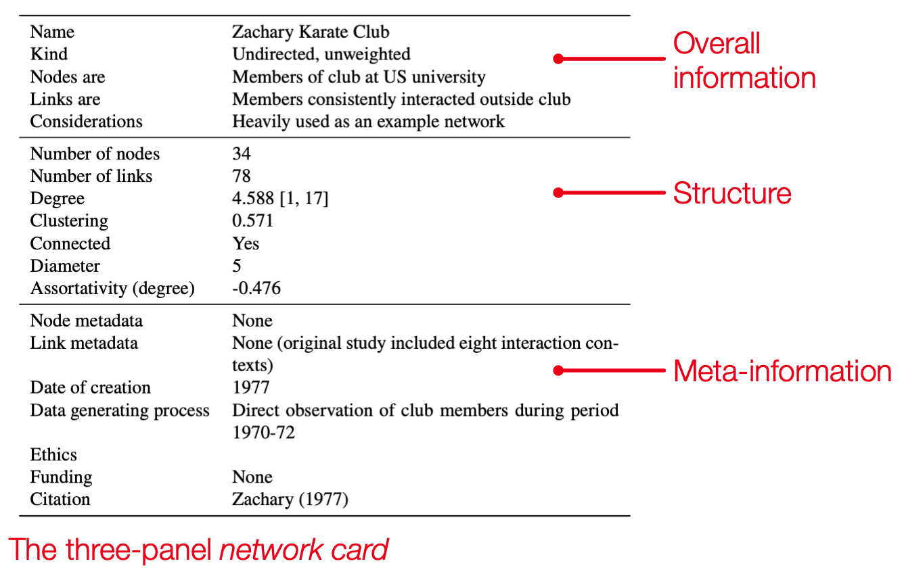

# Network Cards

A network card is a three-panel tabular summary of a network dataset:

<p align='center'>

</p>

The first panel provides an overall summary of the network, the second summarizes the structure of the network (size, density, connectivity), and the third panel provides additional meta-information, what metadata are associated with nodes and links, how were the data gathered, and so forth.

Network cards are intended to be _concise, readable and flexible_, allowing researchers across fields to quickly read and understand studies involving network datasets. 

## Table of Contents

* [Example](#example)
* [Install](#install)
	- [Requirements](#requirements)
* [Citation](#citation)
* [License](#License)


## Example

`Network Cards` provides [fill-in templates](templates/) but you can also generate and save a card programmatically. 
Here's Python code where we load a network from a file and compute the basic card: 

```python
import networkx as nx
import network_cards as nc

G = nx.read_edgelist("karate_club.edgelist")

card = nc.NetworkCard(G)
print(card)
```
This gives:

```text
                   Name                       
                   Kind Undirected, unweighted
              Nodes are                       
              Links are                       
         Considerations                       
        Number of nodes                     34
        Number of links                     78
               Degree^1        4.58824 [1, 17]
             Clustering                  0.571
              Connected                    Yes
               Diameter                      5
 Assortativity (degree)                 -0.476
          Node metadata                       
          Link metadata                       
       Date of creation                       
Data generating process                       
                 Ethics                       
                Funding                       
               Citation                       

^1: Distributions summarized with average [min, max].
```

Unfortunately, none of the important definitions, details or meta-information are computable, so
most of the fields outside the structure panel are blank.
Let's use `network_cards` methods to populate the remaining fields ourselves:

```python
card.update_overall("Name", "Zachary Karate Club")
card.update_overall("Nodes are", "Members of club at US university")
card.update_overall("Links are", "Members consistently interacted outside club")
card.update_overall("Considerations", "Heavily used as an example network")

card.update_metainfo({
    "Node metadata":           "None",
    "Link metadata":           "None (original study included eight interaction contexts)",
    "Date of creation":        "1977",
    "Data generating process": "Direct observation of club members during period 1970-72",
    "Funding":                 "None",
    "Citation":                "Zachary (1977)"
    })
```

We use `card.update_overall` and `card.update_metainfo` to insert entries into the previous card. These can be used one at a time (like we did when updating the overall panel) or a dictionary can be passed to update multiple entries at once.

Now, print the revised card with `print(card)`:

```text
                   Name                                       Zachary Karate Club
                   Kind                                    Undirected, unweighted
              Nodes are                          Members of club at US university
              Links are              Members consistently interacted outside club
         Considerations                        Heavily used as an example network
        Number of nodes                                                        34
        Number of links                                                        78
               Degree^1                                           4.58824 [1, 17]
             Clustering                                                     0.571
              Connected                                                       Yes
               Diameter                                                         5
 Assortativity (degree)                                                    -0.476
          Node metadata                                                      None
          Link metadata None (original study included eight interaction contexts)
       Date of creation                                                      1977
Data generating process  Direct observation of club members during period 1970-72
                 Ethics                                                          
                Funding                                                      None
               Citation                                            Zachary (1977)
```

And we can save to, for instance, a LaTeX file:

```python
card.to_latex("karate-card.tex")
```


## INSTALL

`pip install network-cards`

#### Requirements

* Python 3.8+
* Networkx
* Pandas


## Citation

If you use a Network Card, please cite our paper:

James Bagrow and Yong-Yeol Ahn, Network Cards: concise, readable summaries of network data (2022)

Here is a bibtex entry:

```bibtex
@unpublished{bagrow2022cards,
	author = {Bagrow, James and Ahn, Yong-Yeol},
	title  = {Network Cards: concise, readable summaries of network data},
	year   = {2022},
}
```

## License

[BSD-3-Clause](LICENSE) © James Bagrow

